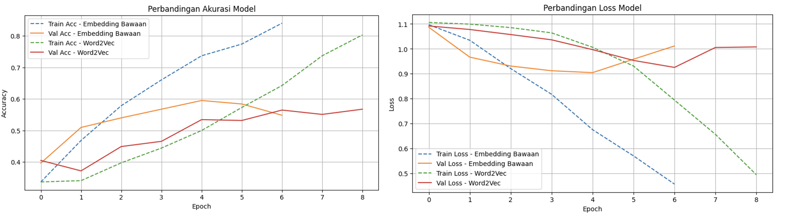
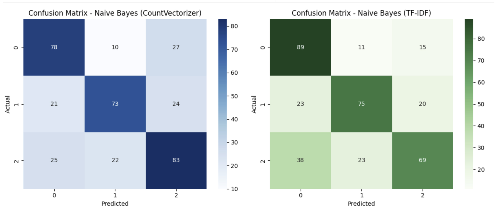

<h1>NLP Project</h1>

Sentiment Analysis on Twitter/X Posts Using Machine Learning and Deep Learning Approaches

 
<h2>1. NLP Model - Sentiment Analysis</h2>

Menganalisis dan mengklasifikasi sentimen terhadap cuitan di <strong>Twitter/X</strong> menggunakan metode text analysis.  
Projek ini menggunakan dua pendekatan algoritma/model:
<ul>
  <li><b>Traditional Machine Learning</b></li>
  <li><b>Neural Network / Deep Learning</b></li>
</ul>

 
<h2>2. Python Libraries</h2>

<h3>📊 Data Processing & Analysis</h3>
<ul>
  <li><b>Pandas</b>: manipulasi dan analisis data tabular</li>
  <li><b>NumPy</b>: operasi numerik dan array</li>
</ul>

<h3>📈 Visualization</h3>
<ul>
  <li><b>Matplotlib</b>: membuat grafik dan visualisasi hasil model</li>
</ul>

<h3>🧠 Machine Learning</h3>
<ul>
  <li><b>Scikit-learn (sklearn)</b>: preprocessing, pembagian data, dan model baseline tradisional</li>
  <li><b>TensorFlow Keras</b>: membangun dan melatih model neural network (Deep Learning)</li>
</ul>

<h3>🗣️ Natural Language Processing</h3>
<ul>
  <li><b>NLTK</b>: tokenisasi, stopwords, dan text preprocessing dasar</li>
  <li><b>Sastrawi</b>: stemming Bahasa Indonesia</li>
  <li><b>FTFY</b>: memperbaiki karakter teks rusak (encoding error)</li>
  <li><b>Emoji</b>: menangani teks yang mengandung emoji agar tetap terbaca oleh model</li>
</ul>

 
<h2>3. Modeling</h2>

<h3>🧮 Traditional Machine Learning Algorithm</h3>
<ul>
  <li><b>Naive Bayes Classifier</b>: model probabilistik klasik untuk klasifikasi teks</li>
  <li><b>CountVectorizer</b>: mengubah teks menjadi representasi numerik berdasarkan frekuensi kata</li>
  <li><b>TF-IDF Vectorizer</b>: memberi bobot kata berdasarkan frekuensi relatif di seluruh dokumen</li>
</ul>

<h3>🧠 Deep Learning Algorithm</h3>
<ul>
  <li><b>LSTM (Long Short-Term Memory)</b>: arsitektur RNN untuk memahami konteks berurutan dalam teks</li>
  <li><b>Embedding Layer</b>: representasi vektor kata yang dipelajari selama pelatihan model LSTM</li>
  <li><b>Word2Vec</b>: pre-trained embedding untuk menangkap makna semantik kata</li>
</ul>

 
<h2>4. Results</h2>

  
    
  

 

📍Jakarta, 2025

